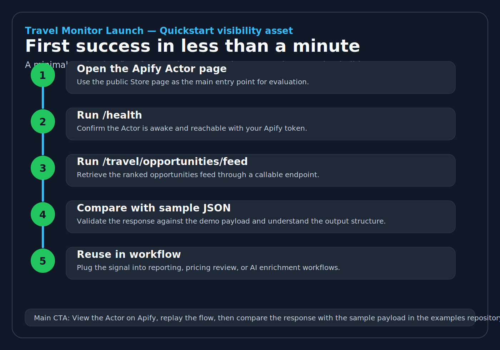
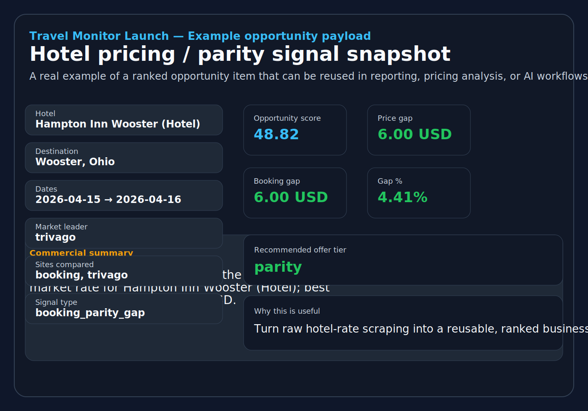

## Hotel Rate Monitoring API — Examples Repository

Ce document sert de **README maître** pour le dépôt GitHub public d’exemples autour de **Hotel Rate Monitoring API** sur Apify. Son objectif est double. D’une part, il agit comme une **surface de découvrabilité hors Store** pour les profils techniques et semi-techniques. D’autre part, il réduit le **time to first success** en donnant un chemin d’essai extrêmement simple, adossé à des sorties réelles déjà extraites de l’API.

Le positionnement retenu reste volontairement précis. Le produit n’est pas présenté comme une API travel générique, mais comme une **API de monitoring tarifaire hôtelier** et de **price parity intelligence** exposée via Apify, avec des sorties prêtes à être réutilisées dans des workflows de **travel operations**, de **pricing analysis**, de **reporting**, ou d’**agents IA**. Le nom marketing privilégié pour la découvrabilité publique est **Hotel Rate Monitoring API**, tandis que le slug technique de l’Actor reste `travel-monitor-launch`.

| Ce dépôt doit aider à faire | Pourquoi c’est utile commercialement |
|---|---|
| **Comprendre la promesse en moins d’une minute** | Réduit la friction avant le premier essai |
| **Rejouer un appel API simple** | Rend la valeur concrète et vérifiable |
| **Voir un payload réel** | Renforce la crédibilité produit |
| **Télécharger des exemples prêts à intégrer** | Facilite l’adoption par développeurs et analystes |
| **Revenir vers la fiche Apify** | Transforme GitHub en surface d’acquisition pour le Store |

## Repository purpose

Le rôle principal de ce dépôt n’est pas de remplacer la documentation complète du produit. Il doit fonctionner comme une **porte d’entrée claire**, plus courte et plus démonstrative, orientée vers un premier succès. Le bon lecteur doit pouvoir comprendre rapidement le cas d’usage, tester un endpoint, lire un exemple de sortie, puis décider s’il veut explorer davantage l’Actor sur Apify.

> **Short promise:** Monitor hotel pricing and parity signals through a standby-ready Apify API, then reuse structured outputs in reporting, analytics, or AI workflows.

| Quick link | Purpose |
|---|---|
| **Apify Actor page** | https://apify.com/travelmonitorlab/travel-monitor-launch?utm_source=github&utm_medium=docs&utm_campaign=launch_april_2026 |
| **First success guide** | `docs/first_success_under_1_minute.md` |
| **AI agents quickstart** | `docs/ai_agents_mcp_quickstart.md` |
| **MCP registry manifest** | `server.json` |
| **MCP publication notes** | `docs/mcp_registry_and_directory_next_steps.md` |
| **OpenAPI file** | `openapi/travel-monitor-launch.openapi.json` |
| **Example payload** | `examples/demo_feed_item.json` |
| **Annotated signal asset** | `assets/annotated_feed_item.svg` |
| **First success visual** | `assets/annotated_first_success_flow.svg` |




| Audience prioritaire | Bénéfice attendu |
|---|---|
| **Revenue managers** | Voir rapidement des écarts OTA visibles et des opportunités tarifaires |
| **Consultants travel** | Obtenir des signaux structurés au lieu de simples pages brutes |
| **Équipes produit / BI** | Alimenter un pipeline analytique ou un dashboard interne |
| **Builders IA / automation** | Brancher une API claire sur un workflow agentique |

## Recommended repository structure

La structure ci-dessous est pensée pour rendre le dépôt immédiatement lisible. Elle sépare la démonstration métier, les snippets techniques et les exemples JSON réutilisables.

```text
travel-monitor-launch-examples/
├── README.md
├── server.json
├── snippets/
│   ├── health_check.sh
│   ├── opportunities_feed.sh
│   ├── plan_catalog.sh
│   └── delivery_bundle.sh
├── examples/
│   ├── demo_feed_item.json
│   ├── demo_opportunities_feed_response.json
│   ├── demo_top_opportunities_response.json
│   ├── demo_delivery_bundle.json
│   ├── demo_plan_catalog.json
│   └── demo_product_offers.json
├── docs/
│   ├── first_success_under_1_minute.md
│   ├── ai_agents_mcp_quickstart.md
│   ├── mcp_registry_and_directory_next_steps.md
│   ├── integration_scenarios.md
│   └── outbound_payload_examples.md
├── openapi/
│   └── travel-monitor-launch.openapi.json
└── assets/
    ├── annotated_feed_item.svg
    └── annotated_first_success_flow.svg
```

## First success in less than a minute

Le chemin d’essai le plus efficace consiste à commencer par un endpoint santé, puis à passer immédiatement à une route démonstrative plus métier. Comme le service est exposé en **Standby mode** sur Apify, l’appel doit inclure un **jeton Apify** valide. Certaines routes métier peuvent aussi dépendre d’une clé métier privée selon le mode d’accès activé.

| Étape | Action |
|---|---|
| **1** | Ouvrir la fiche publique de l’Actor Apify |
| **2** | Récupérer votre jeton Apify |
| **3** | Tester la route `/health` |
| **4** | Tester ensuite `/travel/opportunities/feed` |
| **5** | Comparer le résultat à l’exemple JSON réel fourni dans ce dépôt |

### Health check

```bash
curl "https://travelmonitorlab--travel-monitor-launch.apify.actor/health?token=<YOUR_APIFY_TOKEN>"
```

### Opportunity feed

```bash
curl -H "Authorization: Bearer <YOUR_APIFY_TOKEN>" \
  -H "x-api-key: <YOUR_TRAVEL_API_KEY_IF_REQUIRED>" \
  "https://travelmonitorlab--travel-monitor-launch.apify.actor/travel/opportunities/feed"
```

### Plan catalog

```bash
curl -H "Authorization: Bearer <YOUR_APIFY_TOKEN>" \
  -H "x-api-key: <YOUR_TRAVEL_API_KEY_IF_REQUIRED>" \
  "https://travelmonitorlab--travel-monitor-launch.apify.actor/travel/plans"
```

## Use this with Apify, AI agents, and workflows

Cette surface GitHub doit maintenant jouer un rôle très simple. Elle aide un lecteur à comprendre rapidement le produit, puis l’oriente vers la bonne porte d’entrée selon son contexte : **Apify Store** pour le premier essai, **MCP** pour les assistants IA, **OpenAPI** pour l’intégration développeur, et les exemples JSON pour la réutilisation analytique ou reporting.

| Entrée | Ressource recommandée | Pourquoi c’est utile |
|---|---|---|
| **Premier essai humain** | Fiche Apify + `docs/first_success_under_1_minute.md` | Rejouer le chemin `/health` puis `/travel/opportunities/feed` sans friction inutile |
| **Builders IA / MCP** | `docs/ai_agents_mcp_quickstart.md` | Comprendre l’ordre d’appel agentique et la logique health → feed → export |
| **Registry / directory publication** | `server.json` + `docs/mcp_registry_and_directory_next_steps.md` | Préparer une découvrabilité MCP au-delà d’Apify sans redéployer un serveur séparé |
| **Développeurs API** | `openapi/travel-monitor-launch.openapi.json` | Inspecter rapidement la surface d’API et les routes disponibles |
| **Workflows analytics / reporting** | `examples/` + `snippets/` | Réutiliser des payloads réels et des appels copiables |

> The intended path stays narrow: validate the API first, retrieve one useful pricing signal second, and move to exports or automation only after the value is clear.

## OpenAPI and integration assets

Le dépôt expose désormais la **spécification OpenAPI** utilisée par l’Actor afin de rendre la surface plus crédible pour les intégrateurs, les reviewers techniques et les outils capables d’ingérer automatiquement un contrat d’API.

| Asset | Purpose |
|---|---|
| `server.json` | Manifeste MCP distant prêt pour un référencement registre/annuaire |
| `docs/mcp_registry_and_directory_next_steps.md` | Décide où publier ensuite la couche MCP sans redéploiement inutile |
| `openapi/travel-monitor-launch.openapi.json` | Contrat de routes pour lecture développeur, génération client ou revue technique |
| `snippets/health_check.sh` | Test liveness minimal |
| `snippets/opportunities_feed.sh` | Premier appel métier démonstratif |
| `examples/demo_opportunities_feed_response.json` | Réponse réaliste pour intégration ou comparaison |
| `docs/ai_agents_mcp_quickstart.md` | Pont direct entre le dépôt GitHub et l’usage MCP / agents IA |

## Visual first-success flow

Le dépôt inclut désormais un **visuel réutilisable** du parcours d’évaluation le plus simple. Il peut être repris tel quel dans un post social, un tutoriel court, une page communauté ou un message d’outreach léger.


## Real example payload

L’exemple ci-dessous provient d’une sortie réelle déjà extraite du smoke test. Il est volontairement court, car il sert de **preuve de valeur immédiate** dans le dépôt, dans les messages d’outreach et dans les publications externes.

```json
{
  "feed_rank": 1,
  "opportunity_key": "group_644c57e536983898",
  "destination_label": "Wooster, Ohio",
  "entity_name": "Hampton Inn Wooster (Hotel)",
  "checkin_date": "2026-04-15",
  "checkout_date": "2026-04-16",
  "currency": "USD",
  "opportunity_type": "booking_parity_gap",
  "opportunity_priority": "medium",
  "opportunity_score": 48.82,
  "recommended_offer_tier": "parity",
  "market_leader_site": "trivago",
  "best_price": 136.0,
  "price_gap": 6.0,
  "price_gap_percent": 4.41,
  "booking_gap": 6.0,
  "booking_gap_percent": 4.41,
  "sites": ["booking", "trivago"],
  "commercial_summary": "Booking.com is 6.00 USD above the best observed market rate for Hampton Inn Wooster (Hotel); best visible site: trivago at 136.00 USD."
}
```



| Champ clé | Pourquoi il compte |
|---|---|
| **entity_name** | Le signal porte sur un établissement concret |
| **destination_label** | Le contexte géographique est immédiatement lisible |
| **opportunity_score** | La priorisation est native |
| **market_leader_site** | La comparaison concurrentielle est explicite |
| **price_gap** | La valeur métier est quantifiée |
| **commercial_summary** | Le résultat est déjà lisible pour un décideur |

## Core output families

Le dépôt doit présenter le produit comme un ensemble de **familles de résultats** plutôt que comme une simple liste d’endpoints. Cette lecture aide beaucoup les prospects à se projeter dans un usage réel.

| Output family | Rôle principal | Fichier recommandé |
|---|---|---|
| **Opportunities feed** | Détection et priorisation des signaux | `examples/demo_opportunities_feed_response.json` |
| **Single demo item** | Preuve courte et partageable | `examples/demo_feed_item.json` |
| **Top opportunities** | Lecture prioritaire synthétique | `examples/demo_top_opportunities_response.json` |
| **Delivery bundle** | Réutilisation aval dans des workflows | `examples/demo_delivery_bundle.json` |
| **Plan catalog** | Clarification du cadrage produit | `examples/demo_plan_catalog.json` |
| **Product offers** | Support au packaging et au discours commercial | `examples/demo_product_offers.json` |

## Three use cases to highlight

Il ne faut pas surcharger le dépôt avec trop de promesses. Trois scénarios d’intégration bien choisis suffisent pour rendre le produit concret et mémorisable.

| Scénario | Description courte | Audience cible |
|---|---|---|
| **Daily hotel parity watch** | Détecter chaque jour des écarts OTA visibles et remonter les signaux prioritaires | Revenue managers, consultants distribution |
| **Travel analytics pipeline** | Alimenter un flux analytique avec feed JSON, exports CSV et bundles | Analystes, équipes BI, travel ops |
| **AI agent enrichment** | Fournir à un agent IA des signaux structurés sur opportunités et prix | Builders IA, équipes produit, automation |

## Suggested calls to action

Le dépôt doit contenir des appels à l’action simples, sans ambiguïté. Le visiteur doit comprendre immédiatement quelle suite logique lui est proposée.

| Contexte | CTA conseillé |
|---|---|
| **Fin de README** | View the Actor on Apify and inspect the endpoints |
| **Après le premier snippet** | Start with `/health`, then compare your result with the sample payload |
| **Après le payload réel** | If this matches your use case, try the opportunities feed on the public Actor |
| **Après les cas d’usage** | Use the Store page as the main entry point for testing and onboarding |

## Suggested tracked links

Les liens ci-dessous peuvent être intégrés directement dans le README ou dans les documents reliés au dépôt afin de mesurer l’apport du canal GitHub.

| Usage | URL recommandée |
|---|---|
| **README main CTA** | `https://apify.com/travelmonitorlab/travel-monitor-launch?utm_source=github&utm_medium=docs&utm_campaign=launch_april_2026` |
| **Examples hub CTA** | `https://apify.com/travelmonitorlab/travel-monitor-launch?utm_source=github&utm_medium=examples&utm_campaign=launch_april_2026` |
| **Outbound payload link** | `https://apify.com/travelmonitorlab/travel-monitor-launch?utm_source=github&utm_medium=outreach_asset&utm_campaign=launch_april_2026` |

## Recommended companion files

Le dépôt sera beaucoup plus efficace si le README renvoie vers quelques documents courts et très utilitaires, au lieu de noyer le lecteur dans une documentation exhaustive.

| Fichier compagnon | Rôle |
|---|---|
| `docs/first_success_under_1_minute.md` | Rendre l’essai reproductible très rapidement |
| `docs/ai_agents_mcp_quickstart.md` | Exposer un chemin d’usage clair pour MCP et agents IA |
| `server.json` | Fournir un manifeste MCP distant publiable pour le registre et certains annuaires |
| `docs/mcp_registry_and_directory_next_steps.md` | Clarifier les meilleurs endroits supplémentaires où publier la couche MCP |
| `openapi/travel-monitor-launch.openapi.json` | Donner un contrat d’API exploitable aux intégrateurs |
| `docs/integration_scenarios.md` | Montrer comment réutiliser les sorties |
| `docs/outbound_payload_examples.md` | Offrir une base de partage commercial claire |
| `assets/annotated_feed_item.svg` | Fournir une preuve visuelle immédiatement compréhensible |
| `assets/annotated_first_success_flow.svg` | Rassurer sur la simplicité du parcours d’essai |

## Final note for publication

Une fois publié, ce dépôt doit être utilisé comme **actif pivot** entre la fiche Apify, les posts sociaux, les messages d’outreach et les communautés techniques. Sa réussite ne viendra pas d’un grand volume de texte, mais de sa capacité à **prouver rapidement la valeur**, à **réduire la friction** et à **renvoyer proprement vers la fiche Store**.

Le dépôt contient déjà le **guide “first success under 1 minute”**, le **dossier de snippets** et les **actifs visuels** nécessaires pour un premier cycle de diffusion. Le bloc suivant consiste surtout à relayer ce même noyau de preuve sur les canaux externes et dans les communautés ciblées.
